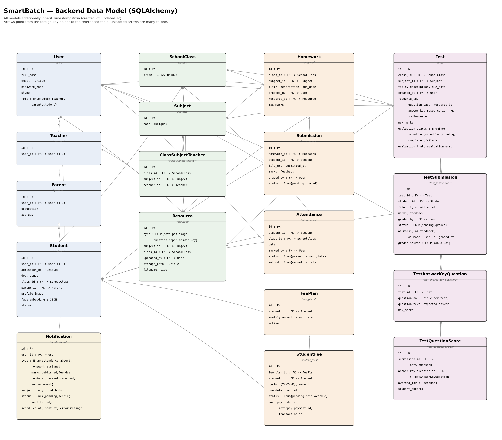
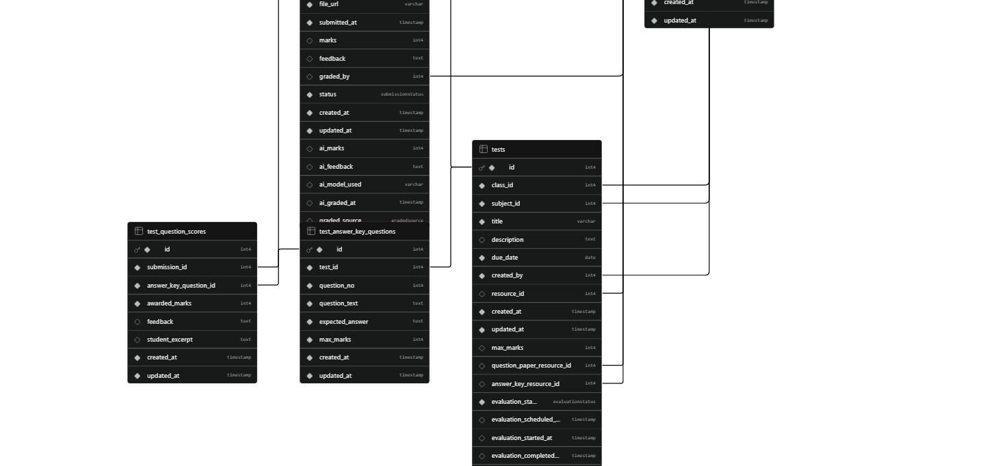

# SmartBatch

SmartBatch is a role-based management platform for a tutoring/coaching institute. It covers student, teacher, class and subject management, homework and tests (with AI-assisted grading), facial-recognition-based attendance, fee billing with Razorpay, a resource library with an AI study assistant (RAG over uploaded PDFs), announcements and email notifications.

The project has two parts:

- `backend/` — a Flask REST API (plus a companion FastAPI microservice for the RAG pipeline)
- `frontend/` — a React + Vite single-page app

There are four user roles: **Admin, Teacher, Parent, Student**, each with their own dashboard and set of pages.

## Architecture




## Tech stack

**Backend**
- Flask 3, Flask-SQLAlchemy, Flask-Migrate (Alembic), Flask-JWT-Extended, Flask-Bcrypt, Flask-Cors, Flask-Limiter, Marshmallow
- Flask-Mail (dev SMTP via Mailtrap) / Resend HTTP API (production email), APScheduler for background/cron jobs
- SQLite (local default) or PostgreSQL (`psycopg2-binary`) in production, via `DATABASE_URL`
- Supabase Storage for file uploads
- DeepFace + OpenCV + TensorFlow for facial-recognition attendance
- LiteLLM for AI test grading; a separate FastAPI microservice (`rag_service/`) using Pinecone + Gemini embeddings for the AI resource assistant (RAG)
- Razorpay for payments
- Gunicorn for production serving

**Frontend**
- React 19, Vite, React Router 7
- Tailwind CSS + shadcn/ui (Radix primitives), Recharts for charts, Sonner for toasts
- oxlint for linting; Bun or npm as package manager

## Repository layout

```
backend/
  app/
    __init__.py        # create_app() factory, blueprint & extension registration, scheduler setup
    models/             # SQLAlchemy models (user, student, teacher, parent, academic, homework, test, attendance, fee, resource, notification)
    routes/              # one blueprint per resource (auth, students, teachers, classes, homework, tests, attendance, fees, payments, announcements, assistant, ...)
    services/            # business logic layer (see below)
    schemas/             # marshmallow request/response schemas
    utils/               # decorators, error helpers, JWT callbacks, pagination, role-based scoping
    templates/email/      # Jinja email templates (HTML + text)
  rag/                    # RAG pipeline: PDF extraction, chunking, embeddings, Pinecone store, grading/answer generation
  rag_service/            # standalone FastAPI app exposing the RAG pipeline
  migrations/             # Alembic migrations (Flask-Migrate)
  scripts/seed_demo_data.py
  tests/                  # pytest suite
  openapi.yaml            # full REST API spec
  run.py                  # app entry point
  Procfile                # Render deployment command

frontend/
  src/
    pages/                # admin/, teacher/, student/, parent/ + Landing, Login
    components/           # DashboardLayout, ProtectedRoute, shared UI, ui/ (shadcn)
    context/AuthContext.jsx
    lib/                  # apiClient.js, authApi.js, navConfig.js, utils.js
    hooks/
  vercel.json              # SPA rewrite config for Vercel

docs/                     # class diagram, DB diagram
```

## Key features

- **Auth** — JWT stored in HttpOnly cookies (access + refresh), CSRF-protected, role-based access (admin/teacher/parent/student)
- **Academics** — classes, subjects, teacher-class-subject assignment, students, parents
- **Homework** — assignment creation, file-upload submissions
- **Tests & AI grading** — test creation, student submissions, and background AI-based grading of answers against an answer key (LLM via LiteLLM), with per-question scoring
- **Attendance** — manual marking plus facial-recognition check-in (DeepFace/OpenCV) against enrolled student photos
- **Fees & payments** — fee plans, recurring fee generation, overdue tracking, Razorpay checkout and webhook verification
- **Resources & AI assistant** — upload PDFs, ingest into a RAG pipeline (Pinecone + Gemini embeddings) so students can ask questions answered from the material
- **Announcements & notifications** — broadcast announcements to students/parents of a class; email notifications for homework assigned, marks published, fee due, payment received, resource ingested, etc. (scheduled via APScheduler)
- **Analytics** — aggregate dashboards (e.g. marks trends) for admin/teacher views

## Getting started

### Backend

```bash
cd backend
python -m venv venv
venv\Scripts\activate       # or `source venv/bin/activate` on macOS/Linux
pip install -r requirements.txt

copy .env.example .env      # then fill in the values (see below)

flask db upgrade            # run migrations
python run.py                # start the dev server (defaults to http://localhost:5000)
```

Other useful commands:

```bash
flask create_admin          # CLI command to create an admin user
flask send_test_email       # CLI command to verify email config
python scripts/seed_demo_data.py   # populate demo data
pytest                      # run the backend test suite
```

Production is served with a single Gunicorn worker (required because of the in-memory APScheduler job store and notification claim logic):

```bash
gunicorn run:app --workers 1 --timeout 120 --bind 0.0.0.0:$PORT
```

To run the RAG microservice separately:

```bash
uvicorn rag_service.main:app
```

Environment variables (see `backend/.env.example` for the full list) include: `SECRET_KEY`, `JWT_SECRET_KEY`, `JWT_COOKIE_SECURE`/`SAMESITE`, `FRONTEND_ORIGIN`, `DATABASE_URL`, `RATELIMIT_STORAGE_URI`, Supabase storage credentials, Mailtrap/`MAIL_*` and `RESEND_API_KEY`/`RESEND_FROM_EMAIL`, Razorpay keys, fee-generation day-of-month settings, `AI_GRADING_*` flags, and Pinecone/Gemini RAG settings.

### Frontend

```bash
cd frontend
npm install          # or bun install

copy .env.example .env    # set VITE_API_URL to point at your backend

npm run dev           # dev server at http://localhost:5173
npm run build          # production build to dist/
npm run lint            # oxlint
npm run preview          # preview the production build
```

## API documentation

The full REST API is documented in [`backend/openapi.yaml`](backend/openapi.yaml).
